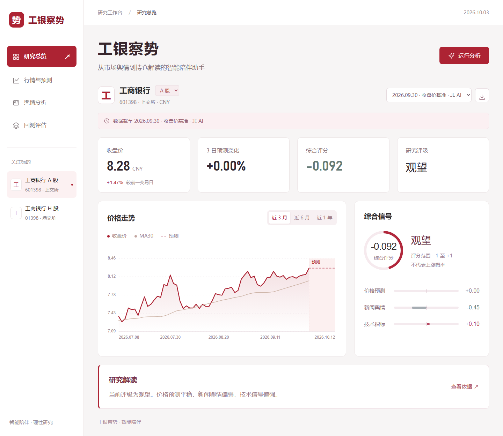
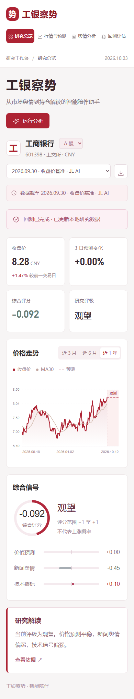
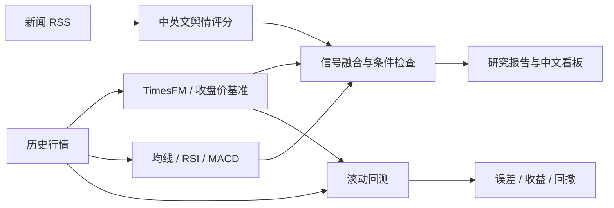

<div align="center">

# 工银察势

### 从市场舆情到持仓解读的智能陪伴助手

让价格、舆情与技术信号，共同支撑研究判断。


[快速开始](#快速开始) · [界面预览](#界面预览) · [AI 模型](#使用-timesfm) · [使用指南](docs/usage.md)

</div>

## 项目介绍

**工银察势**围绕工商银行股票研究，将历史行情、TimesFM 价格预测、新闻舆情和技术指标汇集到一个中文工作台。用户可以观察市场变化、查看综合解读，并通过滚动回测检验研究假设。

当前版本提供**本地研究看板、命令行分析和滚动回测**。项目名中的“持仓解读”是产品方向；个人持仓导入、盈亏归因和对话式陪伴功能尚未实现。

| 研究视角 | 已实现能力 |
| :--- | :--- |
| 行情与预测 | A/H 股数据获取、复权日线、交易日预测、移动均线与走势图 |
| 新闻舆情 | Google News RSS、中英文情绪评分、近期新闻量与情绪走势 |
| 综合解读 | 价格、舆情、技术信号融合，评级依据与条件检查 |
| 回测评估 | 滚动预测误差、含成本策略收益、买入持有对比与最大回撤 |
| 研究工作台 | 深红中文界面、手机布局、后台任务、历史报告与 JSON 导出 |

支持的标的：工商银行 A 股（`ICBC_A` / `601398.SS`）和港股（`ICBC_H` / `1398.HK`）。

## 界面预览



首页集中呈现关键数据、价格走势、综合信号和研究解读。详细指标分别放在“行情与预测”“舆情分析”和“回测评估”页面。

<details>
<summary>查看手机端界面</summary>

<p align="center">
  
</p>

</details>

截图使用本地研究报告；显示数值以实际加载的数据和报告日期为准。仓库自带的 A 股行情样本截至 **2025-10-10**。

## 快速开始

轻量环境支持 **Python 3.11 / 3.12**。前端无需 Node.js、npm 或构建步骤。

### 1. 获取项目

```bash
git clone https://github.com/Airmoond/ai_for_stock_predict.git
cd ai_for_stock_predict
```

### 2. 安装依赖

**Windows / PowerShell：**

```powershell
python -m venv .venv
.\.venv\Scripts\python.exe -m pip install -r requirements.txt
```

<details>
<summary>macOS / Linux 命令</summary>

```bash
python3 -m venv .venv
.venv/bin/python -m pip install -r requirements.txt
```

后续命令中的 `.\.venv\Scripts\python.exe` 替换为 `.venv/bin/python`。

</details>

### 3. 生成离线示例

```powershell
.\.venv\Scripts\python.exe analyze_ticker.py --offline --model naive --end 2025-10-10 --cache-dir reports --output-dir reports/web/runs/demo
```

运行阶段只读取仓库自带缓存，不访问行情或新闻服务，也不下载模型权重。`naive` 是“未来价格等于最后收盘价”的**非 AI 比较基准**，用于验证流程。

### 4. 打开工作台

```powershell
.\.venv\Scripts\python.exe webapp.py --open
```

访问 **[http://127.0.0.1:8000](http://127.0.0.1:8000)**。端口被占用时可添加 `--port 8765`；按 `Ctrl+C` 关闭服务。

在页面点击“运行分析”，选择模型、本地数据或联网更新、预测交易日数。新报告保存在 `reports/web/runs/`，原始历史报告保持独立。港股需要先联网获取数据。

> 看板只监听本机地址，适合个人研究与项目演示。后台任务使用启动看板的同一个 Python 环境。

## 使用 TimesFM

AI 预测使用 `google/timesfm-1.0-200m-pytorch`，固定依赖 `timesfm[torch]==1.3.0`，需单独使用 **Python 3.11** 环境。

```powershell
py -3.11 -m venv .venv-timesfm
.\.venv-timesfm\Scripts\python.exe -m pip install -r requirements-timesfm.txt
.\.venv-timesfm\Scripts\python.exe webapp.py --open
```

启动后在页面选择 **TimesFM · AI 预测**。首次推理需要从 Hugging Face 下载权重；模型加载失败会显示错误，系统不会自动切换为 `naive`。

**验证状态：**目前完成 TimesFM 接口适配测试，真实模型权重推理与完整 TimesFM 回测尚未在本次开发环境中验证。

## 命令行使用

联网更新 A 股行情与舆情，运行基准分析：

```powershell
.\.venv\Scripts\python.exe analyze_ticker.py --ticker ICBC_A --model naive --refresh
```

使用 AI 模型分析港股：

```powershell
.\.venv-timesfm\Scripts\python.exe analyze_ticker.py --ticker ICBC_H --model timesfm --refresh
```

使用本地行情运行滚动回测：

```powershell
.\.venv\Scripts\python.exe backtest.py --model naive --test-sessions 120 --cost-bps 10
```

查看完整参数：

```powershell
.\.venv\Scripts\python.exe analyze_ticker.py --help
.\.venv\Scripts\python.exe backtest.py --help
```

## 分析流程



默认综合评分权重为**价格 55%、舆情 25%、技术 20%**，在 [config.py](config.py) 中配置。缺失或过期舆情按 0 计分，不重新分配权重。预测按交易所日历跳过周末和节假日。

回测仅使用每个信号时点之前的行情：T 日收盘后产生信号，T+1 收盘成交，计算随后一日收益，并计入交易成本。**回测不包含舆情信号**，因为现有 RSS 聚合缺少可验证的历史采集时点。

## 项目结构

```text
ai_for_stock_predict/
├── frontend/                  # 中文界面、响应式布局与图表
├── webapp.py                  # 本地服务与后台分析任务
├── analyze_ticker.py          # 股票分析入口
├── backtest.py                # 滚动回测入口
├── fetch_price.py             # 行情获取、清洗与缓存
├── fetch_sentiment.py         # 新闻获取与舆情评分
├── timesfm_model.py           # TimesFM 与非 AI 基准
├── indicators.py              # 技术指标
├── ensemble.py                # 信号融合
├── recommend.py               # 评级与条件评估
├── trading_calendar.py        # 交易日历
├── storage.py                 # 原子写入
├── config.py                  # 标的、权重与阈值
├── requirements*.txt          # 轻量、AI 与测试依赖
├── tests/                     # 分析流程与看板接口测试
├── reports/                   # 历史样本和运行产物
└── docs/                      # 使用指南、截图与项目展示材料
```

仓库同时保留 `get_data.py`、`prepare_data.py`、`run_model.py` 和 AAPL 示例数据等早期原型文件。当前版本的运行入口为 `webapp.py`、`analyze_ticker.py` 和 `backtest.py`；上述安装命令针对当前版本。

## 测试与数据说明

```powershell
.\.venv\Scripts\python.exe -m pip install -r requirements-dev.txt
.\.venv\Scripts\python.exe -B -m pytest -q -p no:cacheprovider tests
```

目前 **58 项自动化测试通过**，覆盖数据清洗、缓存、交易日历、信号融合、回测时序、报告隔离和本地 HTTP 接口。桌面与手机界面、历史报告切换、离线分析和页面内滚动回测已完成浏览器验证。

- 分析报告使用 `schema_version=2`，记录行情日期、模型、数据质量、分项信号和评级依据。
- 原有 `reports/ICBC_A_report.json` 是旧版历史结果，未经交易日校验的预测不会在看板中绘制。
- `reports/web/`、`reports/validation/`、`reports/backtests/` 为本地生成目录，不随仓库提交。
- 当前价格预测与综合评分不是经过校准的上涨概率；回测尚未模拟冲击成本、涨跌停或停牌成交约束。

完整参数、评分公式、报告字段与常见问题见 **[使用指南](docs/usage.md)**。

## 致谢

[Google Research TimesFM](https://github.com/google-research/timesfm) · [AKShare](https://github.com/akfamily/akshare) · [yfinance](https://github.com/ranaroussi/yfinance) · [exchange_calendars](https://github.com/gerrymanoim/exchange_calendars) · [SnowNLP](https://github.com/isnowfy/snownlp) · [VADER](https://github.com/cjhutto/vaderSentiment)

本项目用于研究、学习与原型验证，输出不构成投资建议。
